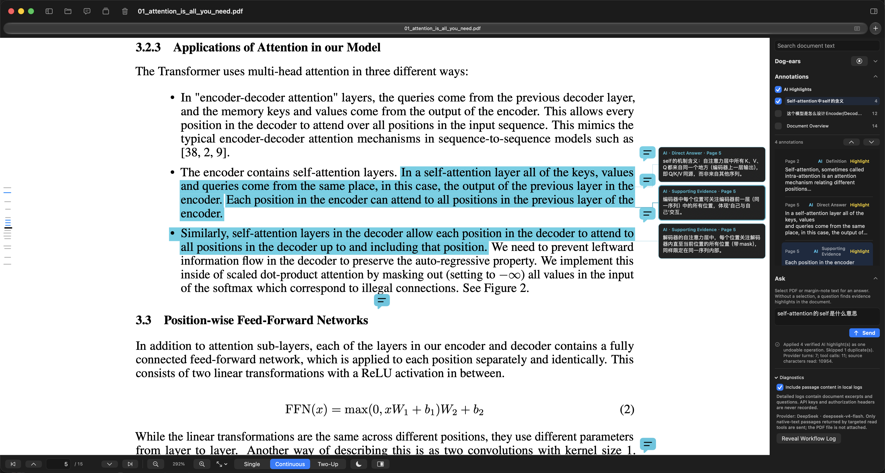

# Dogear

[](https://github.com/kashiwakiS/Dogear/actions/workflows/build.yml)
[](LICENSE)
[](#requirements)

I built Dogear for long-form PDF reading on the Mac. It keeps the reading
surface quiet, makes annotations portable, and keeps page operations reversible.




## What you can do

- Read with single-page, continuous, and two-up layouts, page jump, zoom, fit
  controls, and a non-destructive night display.
- Keep a local Library with Groups, ordering, native tabs, and per-window file
  sessions.
- Add standard PDF highlights and FreeText notes, then navigate them and export
  them as Markdown.
- Use bookmarks, detected headings, and Dog-ear page markers to move through a
  document.
- Use unified Ask for an evidence-grounded document overview or answer, with
  optional source-linked AI Highlights. Organize generated highlights by named
  request group, show any subset, and navigate to supporting passages.
- Read annotation explanations in the page-side Margin Canvas, select their
  text for follow-up questions, and export a PDF containing exactly the AI
  groups you choose.
- Organize, rotate, duplicate, delete, and export pages from an app-managed
  working copy. The original PDF stays untouched until you explicitly confirm
  an overwrite.
- Use the optional OpenAI-compatible reader assistant. It is off by default;
  Dogear remains fully usable without an AI provider.

## Install

Download the latest universal macOS package from
[GitHub Releases](https://github.com/kashiwakiS/Dogear/releases). The current
distribution package is signed with the developer account.

## Build from source

Requirements: macOS 14 or later and Xcode 16.0 or later. Newer toolbar styling
is enabled when building with Xcode 26 or later; Xcode 16 builds use the
compatible flat toolbar.

```bash
git clone https://github.com/kashiwakiS/Dogear.git
cd Dogear
scripts/check-sensitive-info.sh
scripts/build.sh --debug
```

The Debug app is written to `build/Debug/Dogear.app`; a Release build is
written to `build/Release/Dogear.app`. Xcode intermediates live in
`build/DerivedData/`. Use `--output-dir PATH` to choose a different final app
directory. For a clean universal Release build:

```bash
scripts/build.sh --release --clean --universal
```

GitHub Actions runs the same source scan, Debug build, universal Release build,
and app metadata checks for every push and pull request.

### Optional local semantic retrieval

Ask uses lightweight lexical retrieval by default and needs no local model.
For English papers, Settings also offers the experimental “Semantic — Small
EN” mode with a manually imported local BGE Small EN package. Dogear never
downloads this model automatically. Advanced users can install the pinned
dependencies listed at the top of `scripts/prepare-bge-small-en.py` in an
isolated Python environment, then run:

```bash
python scripts/prepare-bge-small-en.py --output /path/to/output
```

The script downloads the pinned upstream model, verifies its weights, and
creates a `SmallEN` folder. Import that folder with “Import Local Model…” in
Dogear's AI settings. Lexical retrieval remains available without this setup.

## Shortcuts

| Action | Shortcut |
| --- | --- |
| Highlight selection | `H` |
| Add FreeText note | `T` |
| Toggle Dog-ear on the current page | `D` |
| Previous / next page | `W` / `S` (also `K` / `J`) |
| Open PDF | `⌘O` |
| Save to Original… | `⌘S` |
| Previous / next page | `⌘↑` / `⌘↓` |
| First / last page | `⌘⌥↑` / `⌘⌥↓` |
| Zoom in / out | `⌘+` / `⌘−` |
| Actual size / fit page / fit width | `⌘0` / `⌘1` / `⌘2` |
| Library navigator | `⌘⌥L` |
| Annotations and AI sidebar | `⌘⌥R` |
| New Group… | `⌘⇧N` |

When the native tab Group preview is open, press an unmodified number from `1`
to `9` to open that file.

## Privacy and file safety

Dogear has no telemetry and no account requirement. Library data stays on the
Mac. Cloud AI is optional and off by default. Ask sends the configured provider
only the question, selected text, and native-text passages read through its
targeted tools; it does not attach the PDF. Each Send starts an independent
question, and Dogear does not save conversation history to disk. See
[PRIVACY.md](PRIVACY.md).

Dogear never overwrites the original PDF during normal editing. Page changes
and annotations are saved to an app-managed working copy. The explicit Save to
Original command requires confirmation and uses an atomic write.

## Contributing

Bug reports and feature requests belong in
[Issues](https://github.com/kashiwakiS/Dogear/issues). Small, focused changes
are welcome through [pull requests](https://github.com/kashiwakiS/Dogear/pulls);
please read [CONTRIBUTING.md](CONTRIBUTING.md) first. Security reports follow
[SECURITY.md](SECURITY.md).

Dogear is licensed under the [GNU General Public License v3.0](LICENSE).
