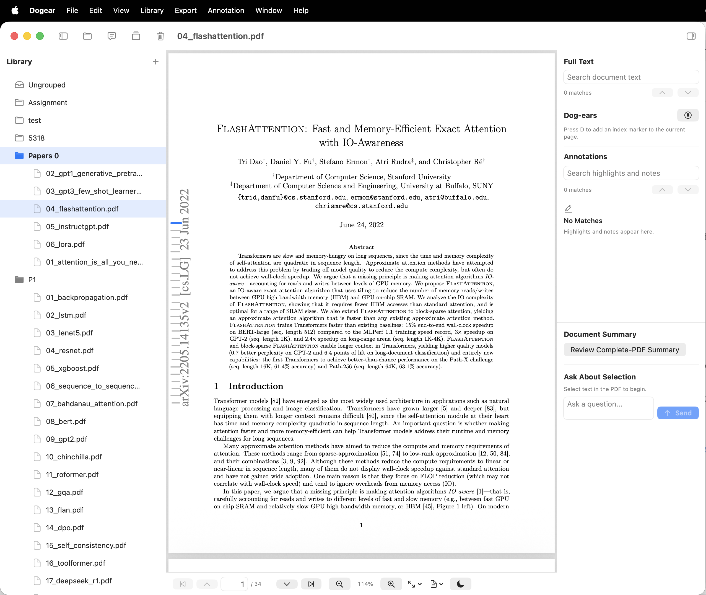

# Dogear

[](https://github.com/kashiwakiS/Dogear/actions/workflows/build.yml)
[](LICENSE)
[](#requirements)

由PDF文件管理的痛点出发自建的PDF阅读管理工具 Dogear

特色：

- 原生PDFKit实现阅读功能
- PDF文件分组管理、页面整理功能
- 便捷的键盘交互
- AI API接口集成



## 安装

你可以由右侧[GitHub Releases](https://github.com/kashiwakiS/Dogear/releases)下载最新构建。0.1.2 及更早版本仍是未签名构建；从 0.1.3 起，正式发行包使用作者个人 Apple Developer 账号签名。请以每个版本的 Release Notes 为准。

## 自行编译

构建要求: macOS 14或更新版本， Xcode 16.0或更新版本。（由于作者没有较低版本的设备，此为理论下限）

```bash
git clone https://github.com/kashiwakiS/Dogear.git
cd Dogear
scripts/check-sensitive-info.sh
scripts/build.sh --debug
```

Debug 应用会输出到 `build/Debug/Dogear.app`，Release 应用会输出到
`build/Release/Dogear.app`。Xcode 的中间构建文件位于 `build/DerivedData/`；
如需指定其他最终输出目录，可使用 `--output-dir PATH`。
如需一次干净的通用 Release 构建：

```bash
scripts/build.sh --release --clean --universal
```

GitHub Actions 会在每次推送和 Pull Request 中运行相同的源码扫描、Debug 构建、通用 Release 构建和应用元数据检查。

## 快捷键


| 操作                           | 快捷键                        |
| ------------------------------ | ----------------------------- |
| 高亮选中内容                   | `H`                           |
| 添加 FreeText 备注             | `T`                           |
| 添加/删除当前页的 Dog-ear      | `D`                           |
| 上一页 / 下一页                | `W` / `S`（也支持 `K` / `J`） |
| 打开 PDF                       | `⌘O`                         |
| 保存到原文件…                 | `⌘S`                         |
| 上一页 / 下一页                | `⌘↑` / `⌘↓`               |
| 第一页 / 最后一页              | `⌘⌥↑` / `⌘⌥↓`           |
| 放大 / 缩小                    | `⌘+` / `⌘−`                |
| 实际大小 / 适应页面 / 适应宽度 | `⌘0` / `⌘1` / `⌘2`         |
| 资料库导航器（左侧边栏）       | `⌘⌥L`                       |
| 批注与 AI 侧边栏（右侧边栏）   | `⌘⌥R`                       |
| 新建群组…                     | `⌘⇧N`                       |

当原生标签页组预览打开时，按未修饰的数字键 `1` 到 `9` 可打开对应文件。

## 隐私和文件安全

Dogear 没有遥测，也不需要账户。资料库数据只保存在你的 Mac 上。云 AI 为可选功能，默认关闭；文档摘要会将你确认过的 PDF 发送给你配置的提供商，选区提问则只发送选中的文本和对话内容。详见 [PRIVACY.md](PRIVACY.md)。

在正常编辑中，Dogear 绝不会覆盖原始 PDF。页面更改和批注会保存到应用管理的工作副本中。明确的“保存到原文件”命令需要确认，并使用原子写入。

## 贡献

Bug 报告和功能请求请提交到 [Issues](https://github.com/kashiwakiS/Dogear/issues)。欢迎通过 [pull requests](https://github.com/kashiwakiS/Dogear/pulls) 提交小型、聚焦于具体功能的改动；请先阅读 [CONTRIBUTING.md](CONTRIBUTING.md)。安全问题请遵循 [SECURITY.md](SECURITY.md)。

Dogear 使用 [GNU General Public License v3.0](LICENSE) 许可。
