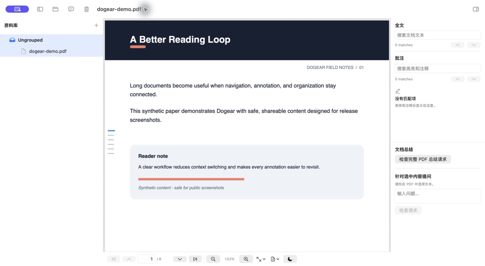

# Dogear

[](https://github.com/kashiwakiS/Dogear/actions/workflows/build.yml)
[](LICENSE)
[](#requirements)

I built Dogear for long-form PDF reading on the Mac. It keeps the reading
surface quiet, makes annotations portable, and keeps page operations reversible.



## What you can do

- Read with single-page, continuous, and two-up layouts, page jump, zoom, fit
  controls, and a non-destructive night display.
- Keep a local Library with Groups, ordering, native tabs, and per-window file
  sessions.
- Add standard PDF highlights and FreeText notes, then search, navigate, and
  export them as Markdown.
- Use bookmarks, detected headings, and Dog-ear page markers to move through a
  document.
- Organize, rotate, duplicate, delete, and export pages from an app-managed
  working copy. The original PDF stays untouched until you explicitly confirm
  an overwrite.
- Use the optional OpenAI-compatible reader assistant. It is off by default;
  Dogear remains fully usable without an AI provider.

## Install

Download the latest universal macOS package from
[GitHub Releases](https://github.com/kashiwakiS/Dogear/releases). The package
contains `Dogear.app`; macOS may ask you to confirm opening an unsigned build.

## Build from source

Requirements: macOS 14 or later and Xcode 26.5 or later.

```bash
git clone https://github.com/kashiwakiS/Dogear.git
cd Dogear
scripts/check-sensitive-info.sh
scripts/build.sh --debug
```

The app is written to `${TMPDIR:-/tmp}/DogearDerivedData/Build/Products/Debug/Dogear.app`.
For a clean universal Release build:

```bash
scripts/build.sh --release --clean --universal
```

GitHub Actions runs the same source scan, Debug build, universal Release build,
and app metadata checks for every push and pull request.

## Shortcuts

| Action | Shortcut |
| --- | --- |
| Highlight selection | `H` |
| Add FreeText note | `T` |
| Toggle Dog-ear on the current page | `D` |
| Previous / next page | `W` / `S` (also `K` / `J`) |
| Open PDF | `⌘O` |
| Save to Original… | `⌘S` |
| Previous / next page | `⌘↑` / `⌘↓` |
| First / last page | `⌘⌥↑` / `⌘⌥↓` |
| Zoom in / out | `⌘+` / `⌘−` |
| Actual size / fit page / fit width | `⌘0` / `⌘1` / `⌘2` |
| Library navigator | `⌘⌥L` |
| Annotations and AI sidebar | `⌘⌥R` |
| New Group… | `⌘⇧N` |

When the native tab Group preview is open, press an unmodified number from `1`
to `9` to open that file.

## Privacy and file safety

Dogear has no telemetry and no account requirement. Library data stays on the
Mac. Cloud AI is optional and off by default; a document summary sends the
reviewed PDF to the provider you configure, and a selection question sends the
selected text and conversation. See [PRIVACY.md](PRIVACY.md).

Dogear never overwrites the original PDF during normal editing. Page changes
and annotations are saved to an app-managed working copy. The explicit Save to
Original command requires confirmation and uses an atomic write.

## Contributing

Bug reports and feature requests belong in
[Issues](https://github.com/kashiwakiS/Dogear/issues). Small, focused changes
are welcome through [pull requests](https://github.com/kashiwakiS/Dogear/pulls);
please read [CONTRIBUTING.md](CONTRIBUTING.md) first. Security reports follow
[SECURITY.md](SECURITY.md).

Dogear is licensed under the [GNU General Public License v3.0](LICENSE).
